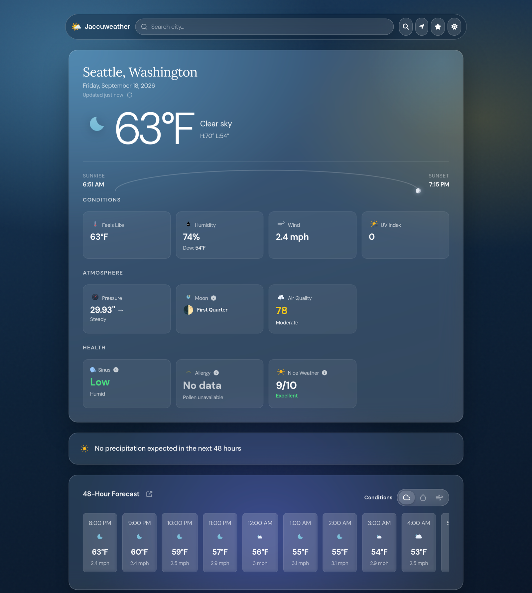

<div align="center">


# Jaccuweather

**A vanilla-JS weather app on a single [Cloudflare Worker](https://workers.cloudflare.com/).**  
No framework, client-rendered, free public APIs. The Worker embeds the HTML, JavaScript, and icons, and proxies a few APIs so the browser avoids CORS errors.

**Demo:** [weather.janglim.cloud](https://weather.janglim.cloud)

[](#license)
[](https://workers.cloudflare.com/)
[](https://nodejs.org/)
[](https://weather.janglim.cloud)



*Live app on the dark glass theme — Seattle.*

</div>

---

## What you get

- Current conditions: temperature, feels-like, humidity, wind, UV, pressure trend, AQI
- Sunrise and sunset arc (sun marker along the path by day, moon after dark)
- Moon phase detail modal
- 48-hour forecast with Conditions, Precipitation, and Wind toggle
- 14-day forecast with week separators
- Detail modals with ApexCharts for hourly and daily views
- Health scores: sinus risk, allergy risk, nice-weather index (each with a methodology modal)
- Pollen levels and 5-day pollen forecast
- Ventusky radar centered on the selected location
- NWS alerts for US locations
- NOAA tides on coastal locations
- City search with autocomplete, geolocation, and local favorites

Core weather works without API keys. Optional keys improve pollen coverage.

## Requirements

- [Node.js](https://nodejs.org/) 18 or higher
- npm
- A [Cloudflare](https://dash.cloudflare.com/) account (the free tier is enough)
- [Wrangler](https://developers.cloudflare.com/workers/wrangler/) (installed via `npm install`). Wrangler **4.36 or higher** is required — this project pins `^4.54.0` in `package.json`. Older Wrangler versions cannot parse the `[[ratelimits]]` block in `wrangler.toml`

## Quick start

```bash
git clone https://github.com/anglim3/jaccuweather.git
cd jaccuweather
npm install
```

### Configure Cloudflare

1. Do not commit a personal `account_id` in `wrangler.toml`. After login, Wrangler uses your default account. You can also set `CLOUDFLARE_ACCOUNT_ID` in the environment.
2. Log in once:

```bash
npx wrangler login
```

### Run locally

```bash
npm run dev
```

Open the URL Wrangler prints (default `http://127.0.0.1:8787`).

If port 8787 is busy:

```bash
npm run build
npx wrangler dev --ip 127.0.0.1 --port 8793
```

Edit files under `public/`. Then rebuild and restart `npm run dev` so `src/index.js` is regenerated. Do not edit `src/index.js` by hand. The build step overwrites it.

### Deploy

```bash
npm run deploy
```

This builds and deploys the Worker named `weather-app` from `wrangler.toml`. After deploy, attach a custom domain in the Cloudflare dashboard if you want one.

Optional: set the account ID for that command only:

```bash
CLOUDFLARE_ACCOUNT_ID=your_account_id npm run deploy
```

## Optional secrets and bindings

Pollen works without secrets via Open-Meteo. For better coverage, add Worker secrets:

| Name | Required | Purpose |
|------|----------|---------|
| `GOOGLE_POLLEN_API_KEY` (secret) | No | Primary pollen source (Google Pollen API) |
| `TOMORROW_API_KEY` (secret) | No | Secondary pollen fallback |
| `POLLEN_RATE_LIMIT` (binding, not a secret) | No | Rate-limit binding on `/api/pollen`. Simple limit of **20 requests / 60 seconds**, configured in `wrangler.toml` (set up automatically on deploy; no action needed). |

```bash
npx wrangler secret put GOOGLE_POLLEN_API_KEY
npx wrangler secret put TOMORROW_API_KEY
```

For local development, put local-only copies of the secrets in a `.dev.vars` file at the project root. `wrangler dev` loads them automatically (no `--remote` needed):

```ini
GOOGLE_POLLEN_API_KEY=your_google_pollen_key
TOMORROW_API_KEY=your_tomorrow_key
```

Do not commit `.dev.vars` — keep it local only.

Local `wrangler dev` does not load remote secrets by default. To test with production secrets instead:

```bash
npx wrangler dev --remote --ip 127.0.0.1 --port 8789
```

## Project layout

```
jaccuweather/
├── public/
│   ├── index.html          # UI and CSS (edit this)
│   ├── app.js              # Frontend logic (edit this)
│   ├── favicon.svg
│   └── icons/
│       ├── weather/        # Meteocons fill, weather-code icons
│       ├── cards/          # Meteocons static fill, card headers
│       └── alerts/         # Meteocons fill, NWS alert alarms
├── src/
│   └── index.js            # Generated Worker. Do not edit.
├── patches/                # Applied by lockdown-worker.js at build
├── tests/
├── build.js                # Embeds public/* and defines API proxy routes
├── lockdown-worker.js      # Patches the generated Worker (run by npm run build)
├── convert-favicon.js      # SVG to PNG for Apple touch icon (uses sharp)
├── asset-version.js        # Generates versioned (?v=<hash>) asset URLs so deploys bust long-lived icon caches
├── docs/                   # Project docs
│   └── screenshots/        # UI screenshots used in this README
├── AGENTS.md               # Notes for coding agents
├── wrangler.toml
└── package.json
```

| Script | Description |
|--------|-------------|
| `npm run build` | `node build.js && node lockdown-worker.js` — generate `src/index.js` from `public/*`, then apply lockdown |
| `npm run dev` | Build and start the local Worker dev server |
| `npm run deploy` | Build and deploy to Cloudflare |

Syntax check before shipping:

```bash
node --check public/app.js && node --check build.js && npm run build && node --check src/index.js
```

Tests:

```bash
node --test tests/*.test.js
```

## How it works

1. `build.js` inlines `public/index.html`, `public/app.js`, and assets (including icons) into a single Worker file.
2. `lockdown-worker.js` applies the `patches/` updates, rate-limits `/api/pollen`, and removes the Ventusky HTML proxy. The built Worker embeds Ventusky directly.
3. The Worker serves the app and proxies `/api/*` routes with caching where useful. Tides are fetched in the browser from NOAA.
4. Favorites live in IndexedDB with a localStorage fallback. Theme preference is stored in the browser only.

### Bindings

Defined in `wrangler.toml`:

- Worker name: `weather-app`, with `compatibility_date` `2024-01-01`
- `POLLEN_RATE_LIMIT` — rate-limit binding on `/api/pollen` (simple limit of 20 requests / 60 seconds)
- Optional secrets: `GOOGLE_POLLEN_API_KEY` and `TOMORROW_API_KEY` (see [Optional secrets and bindings](#optional-secrets-and-bindings))

### Worker routes

These are the routes the built Worker actually serves. `/ventusky-proxy/*` is defined in `build.js` and then stripped by lockdown.

| Route | Upstream |
|-------|----------|
| `/`, `/app.js`, favicons | Embedded static assets |
| `/icons/weather/*` | Vendored weather-code icons |
| `/icons/cards/*` | Vendored card header icons |
| `/icons/alerts/*` | Vendored NWS alert icons |
| `/api/forecast` | Open-Meteo forecast |
| `/api/geocoding` | Open-Meteo geocoding |
| `/api/reverse` | BigDataCloud reverse geocode |
| `/api/air-quality` | Open-Meteo air quality |
| `/api/pollen` | Google Pollen, then Tomorrow.io, then Open-Meteo |
| `/api/alerts` | NWS alerts (US only) |
| `/api/nws-points` | NWS points |
| `/api/nws-wms` | NWS radar WMS tiles |

### UI notes for theming

- Fonts: DM Sans for UI text, Lora for location titles
- Accent color: soft sky blue. Sun marker is gold.
- Layout: glass cards over a full-page background, max width 920px
- Theme toggle: dark mode keeps a static deep-blue background. Light mode applies weather-based gradients (sunny, cloudy, rain, storm, snow, fog, clear night).
- Sun arc: SVG path in the hero card. The marker position follows location-local sunrise and sunset times.

## Troubleshooting

| Problem | Fix |
|---------|-----|
| Changes in `public/` do not appear | Run `npm run build` and restart `wrangler dev` |
| `sharp` missing on build | Optional. Favicon PNG conversion warns and continues. `npm install` should install it as a devDependency. |
| Pollen always empty | Coverage varies by location. Optional Google or Tomorrow secrets help. Without them Open-Meteo is used. |
| Radar blank or navigates away | The built Worker embeds Ventusky directly (the HTML proxy is stripped at build). If the iframe stays blank, use the on-page fallback link. |
| NWS alerts fail | US locations only. The Worker must send a User-Agent header (already set in `build.js`). |
| Wrong account on deploy | Log in with Wrangler or pass `CLOUDFLARE_ACCOUNT_ID`. Do not commit a personal `account_id` in `wrangler.toml`. |

## Credits

| Role | Source |
|------|--------|
| Forecast, geocoding, air quality | [Open-Meteo](https://open-meteo.com/) |
| Pollen | Google Pollen API, Tomorrow.io, Open-Meteo |
| Maps | [Ventusky](https://www.ventusky.com/) |
| Alerts and radar tiles | [NWS](https://www.weather.gov/) |
| Tides | [NOAA](https://tidesandcurrents.noaa.gov/) |
| Moon times | [SunCalc.js](https://github.com/mourner/suncalc) |
| Charts | [ApexCharts](https://apexcharts.com/) |
| Math in methodology modals | [MathJax](https://www.mathjax.org/) |
| Weather-code icons (fill, vendored) | [Meteocons](https://github.com/basmilius/meteocons) by Bas Milius (MIT) |
| Card header icons (static fill, vendored) | [Meteocons](https://github.com/basmilius/meteocons) by Bas Milius (MIT). Sinus still uses Font Awesome. |
| NWS alert icons (fill, vendored) | [Meteocons](https://github.com/basmilius/meteocons) by Bas Milius (MIT) |
| UI chrome (search, chevrons, clocks, close) | [Font Awesome](https://fontawesome.com/) |
| CSS utilities | [Tailwind CSS](https://tailwindcss.com/) |
| Reverse geocode | [BigDataCloud](https://www.bigdatacloud.com/) |
| Fonts | [DM Sans](https://fonts.google.com/specimen/DM+Sans), [Lora](https://fonts.google.com/specimen/Lora) |

## License

MIT

## Author

Jack Anglim
